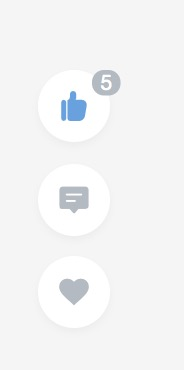

# react_hooks
react Hook 的一些 demo


先来简单了解一下下，

### Hooks

**100％向后兼容**

官方解释：Hooks 是一种 **函数**，该函数允许您从函数式组件 “勾住(hook into)” React 状态和生命周期功能

在函数组件中可以利用hooks 函数去和react 所提供的状态的特性和生命周期函数功能建立联系


#### Effect Hook

官方解释：你之前很可能已经执行了数据提取、订阅、或手工改变来自 React 组件的 DOM。我们称这些操作为“副作用（side effect）”，因为它们会影响其他组件，并且在渲染过程中无法完成。Effect Hook，`useEffect`，增加了从函数式组件执行副作用的功能。

你的一个事件或某一项功能去修改了你的函数或作用域之外的一些特性或功能的时候称之为副作用

以往，在使用类组件的时候，这些副作用的功能通常会写在 类组件的生命周期函数中，但是现在在函数组件中没有了这些生命周期函数，因此react hook 可以用于处理这些功能函数


#### Hook 的规则

- 只能在顶层调用 Hook，不要在循环、条件或嵌套函数中调用 Hook。
- 仅从 React 函数式组件中调用 Hook。不要从常规 JavaScript 函数调用 Hook。（还有另一个有效的地方来调用 Hook，即你的自定义 Hook。）


#### 自定义 Hook

有时，我们希望在组件之间重用一些 有状态逻辑，以前我们比较流行的方案是 [高阶组件](http://react.html.cn/docs/higher-order-components.html) 和 [渲染属性(props)](http://react.html.cn/docs/render-props.html)

这两种方案呢有一些小缺点：

--------高阶组件：可读性降低，逻辑有点复杂

--------渲染属性：需要一层层嵌套，当逻辑复杂时，会增加层次嵌套

那么。。。

当使用 react hooks 之后对这些问题都会有一些非常好的解决方案


接下来开始 react Hooks 的案例学习   

**useState 点赞案例:**

基本语法：

```react
const [state, setState] = useState(initialState);
```

1. useState 返回 stateful(有状态) 值，以及更新这个状态值的函数
2. initialState 即 state 的初始值

实现点赞案例，主要代码：

```react
const [dot, setDot] = useState(0);
...
<div onClick={() => setDot(dot + 1)}></div>
...
// 好像...超级简单...
```

具体代码点这：[这](https://github.com/weily22/react_hooks/blob/master/src/pages/UseStateDemo/UseEffectDemo.jsx)

效果预览：

 


**useEffect 点赞案例 上:**

基本语法：

```react
useEffect(didUpdate);
```

1. 本身是一个函数，且接受一个函数，接受的这个函数包含强制性，可能有 effectful（副作用） 代码的函数
2. 副作用 ：就是说函数的这个行为不仅仅会影响到函数自身作用域内的一些改变，，还会涉及到其作用域外的一些影响。

`useEffect(didUpdate)` 这句代码的意思就是，

告诉react 渲染后要做什么，类似于：componentDidMount，componentDidUpdate，componentWillUnmount，但是统一成了一个 api

3. 默认情况下，效果在每次完成渲染后运行，但是你可以选择 [仅在某些值发生更改时](http://react.html.cn/docs/hooks-reference.html#conditionally-firing-an-effect) 触发它

demo:

每次点赞完，就显示文字被点赞了：

主要代码：

```react
useEffect(() => {
    console.log('我被渲染了');
    if (dot) {
      document.getElementById('heart').style.display = 'block';
      setTimeout(() => {
        document.getElementById('heart').style.display = 'none';
      }, 800)
    }
  });
```

具体代码点这：[这](https://github.com/weily22/react_hooks/blob/master/src/pages/UseEffectDemo/UseEffectDemo.jsx)

效果预览：

